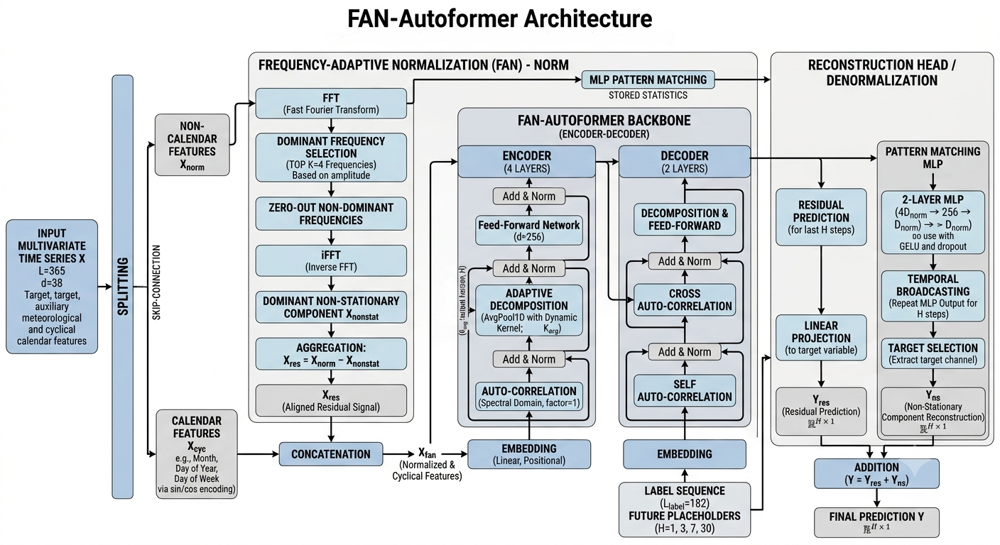

# 🌡️ FAN-Autoformer: A Frequency-Adaptive Framework for Non-Stationary Time Series Forecasting with XAI

<p align="center">
  <a href="https://github.com/mojtaba2600/Fan-Autoformer">
    
  </a>
  
  
  
  
</p>

> **Official PyTorch implementation** of the paper:
> *"FAN-Autoformer: A Frequency-Adaptive Framework for Non-Stationary Time Series Forecasting with XAI"*
> Mojtaba Fatollahi, Sondos Bahadori, Maryam Nooraei Abadeh — Islamic Azad University

---

## 📌 Overview

**FAN-Autoformer** is a unified multivariate deep learning framework that addresses **non-stationarity** and **distribution shift** in real-world meteorological time series. It integrates three synergistic mechanisms into the Autoformer backbone:

| Component | Description |
|---|---|
| **FAN Layer** (Frequency-Adaptive Normalization) | Identifies and removes dominant non-stationary frequency components via FFT *before* the transformer backbone |
| **AutoKernel** (Dynamic Progressive Decomposition) | Adaptively calibrates the smoothing kernel to the forecasting horizon, ensuring phase-continuous trend extraction |
| **Auto-Correlation Encoder-Decoder** | Captures long-range periodic dependencies at O(L log L) complexity via the Wiener-Khinchin theorem |

> 💡 **Core Insight from Ablation Study:** Optimal meteorological forecasting requires a *hybrid processing paradigm* — **frequency-domain normalization** for distribution alignment and **time-domain decomposition** to preserve phase continuity and prevent Gibbs ringing artifacts.

---

## 🏗️ Architecture

<p align="center">
  
</p>

**Pipeline:**
1. **Input:** Multivariate time series (T_min + exogenous: T_max, humidity, vapor pressure, precipitation) + 6 cyclical calendar features (sine-cosine encoded)
2. **FAN Layer:** FFT → extract top-K non-stationary components → filter → iFFT → stationary residual fed to transformer
3. **AutoKernel Decomposition:** Adaptive AvgPool with horizon-scaled kernel → trend + seasonal components
4. **Auto-Correlation Encoder-Decoder:** O(L log L) periodic dependency modeling
5. **Output restoration:** FAN de-normalization + transformer output composition

---

## 📊 Experimental Results

Evaluated on daily minimum temperature (T_min) at **Ilam Shohada Airport (ICAO: OICI)**, western Iran — a challenging semi-arid highland station with strong seasonal non-stationarity.

- **Look-back window:** 365 days
- **Horizons:** H ∈ {1, 3, 7, 30} days
- **Seeds:** 5 independent random seeds (42, 123, 456, 789, 1011)
- **Metrics:** MAE (↓), RMSE (↓), R² (↑), sMAPE (↓)

### Short-term Horizons (H = 1, 3 days)

| Model | MAE ↓ (H=1) | MAE ↓ (H=3) | R² ↑ (H=1) | R² ↑ (H=3) |
|---|---|---|---|---|
| **FAN-Autoformer (Ours)** | 1.5531 ± 0.059 | 1.9213 ± 0.036 | 0.9369 ± 0.004 | 0.9061 ± 0.004 |
| Informer | **1.3940 ± 0.012** | **1.8923 ± 0.088** | **0.9484 ± 0.001** | **0.9073 ± 0.009** |
| FEDformer | 2.0283 ± 0.065 | 2.4079 ± 0.016 | 0.8977 ± 0.006 | 0.8512 ± 0.002 |
| PatchTST | 1.7407 ± 0.013 | 2.0612 ± 0.017 | 0.9233 ± 0.001 | 0.8935 ± 0.002 |
| TimeXer | 1.8300 ± 0.034 | 2.0615 ± 0.020 | 0.9174 ± 0.002 | 0.8918 ± 0.001 |
| iTransformer | 1.8683 ± 0.030 | 2.1350 ± 0.028 | 0.9148 ± 0.002 | 0.8844 ± 0.003 |
| Autoformer | 2.2142 ± 0.159 | 2.8774 ± 0.471 | 0.8785 ± 0.019 | 0.7990 ± 0.059 |

### Medium/Long-term Horizons (H = 7, 30 days)

| Model | MAE ↓ (H=7) | MAE ↓ (H=30) | R² ↑ (H=7) | R² ↑ (H=30) |
|---|---|---|---|---|
| **FAN-Autoformer (Ours)** | 2.1733 ± **0.016** | 2.3171 ± **0.057** | 0.8827 ± **0.002** | 0.8682 ± **0.006** |
| Informer | **2.0457 ± 0.028** | **2.2247 ± 0.074** | **0.8926 ± 0.003** | **0.8723 ± 0.007** |
| TimeXer | 2.1619 ± 0.020 | 2.1987 ± 0.042 | 0.8783 ± 0.002 | 0.8762 ± 0.004 |
| Autoformer | 2.6106 ± 0.367 | 2.6737 ± 0.268 | 0.8293 ± 0.049 | 0.8303 ± 0.031 |

> ✅ **FAN-Autoformer achieves the lowest inter-seed variance across all horizons** — demonstrating superior optimization stability compared to all baselines, including Informer, PatchTST, iTransformer, and vanilla Autoformer. The FAN module smooths the loss landscape by disentangling non-stationary components prior to the attention layers.

---

## 🔍 Interpretability & Explainability (GradCAM-based Attribution)

Gradient-weighted activation analysis (GradCAM) reveals that FAN-Autoformer autonomously internalizes **physically meaningful** atmospheric dynamics — without any explicit inductive bias encoding these phenomena:

| Feature | Physical Interpretation |
|---|---|
| `tmin_lag14` | Quasi-biweekly Rossby wave periodicities (14-day mesoscale oscillation over Zagros foothills) |
| `tmin_diff_1` | Thermal advection gradients and synoptic cold front passages (cross-attention acts as heat advection detector) |
| `humidity_range` + `p0min` | Nocturnal Boundary Layer (NBL) radiational cooling parametrization |

The model also exhibits a **three-phase, curriculum-like learning trajectory**:
- **Epochs 0–10:** Short-term temporal anchors (lag-1, rolling std)
- **Epochs 10–35:** Mesoscale periodicities (lag-14, EWM-7)
- **Epochs 35–46:** Integration of exogenous atmospheric covariates (humidity range, tmin_diff_1)

Interactive HTML visualizations for all 5 seeds × 4 horizons are available in [`XAI-interpretability_outputs/`](XAI-interpretability_outputs/).

---

## ⚙️ Installation

```bash
git clone https://github.com/mojtaba2600/Fan-Autoformer.git
cd Fan-Autoformer
pip install -r models/requirements.txt
```

**Core dependencies:**
- Python ≥ 3.8
- PyTorch ≥ 1.12
- numpy, pandas, scikit-learn, matplotlib

---

## 🚀 Quick Start

Open and run the main notebook:

```bash
jupyter notebook models/FAN-Autoformer.ipynb
```

To reproduce the best-epoch XAI results across all seeds and horizons:

```bash
jupyter notebook models/FAN-Autoformer-best-epoch.ipynb
```

The dataset is pre-loaded from [`data/ilam_weather.csv`](data/ilam_weather.csv) and requires no additional preprocessing.

---

## 📁 Repository Structure

```
FAN-Autoformer/
├── models/
│   ├── FAN-Autoformer.ipynb            # Main model with full XAI pipeline
│   ├── FAN-Autoformer-best-epoch.ipynb # Best-epoch tracking across 5 seeds
│   └── requirements.txt
├── data/
│   └── ilam_weather.csv                # Pre-processed Ilam Airport dataset (20 years)
├── figures/
│   ├── architecture.png                # Overall model architecture
│   ├── fft.png                         # FAN normalization visualization
│   ├── fig_gibbs_ringing_tmin.png      # Gibbs ringing ablation illustration
│   ├── Ablation_Chart_dynamic_fixed.png
│   ├── Ablation_Chart_fft_avg.png
│   └── result/                         # Per-model forecasting result plots
├── XAI-interpretability_outputs/       # Interactive HTML visualizations (5 seeds × 4 horizons)
│   ├── seed42_H1/
│   │   ├── attention_heatmap_best.html
│   │   ├── layer_importance_best.html
│   │   ├── temporal_trend_best.html
│   │   └── training_progress_best.html
│   └── ...
└── README.md
```

---

## 📄 Dataset

| Attribute | Details |
|---|---|
| **Station** | Ilam Shohada Airport (ICAO: OICI) |
| **Location** | 33.58°N, 46.40°E — elevation 1,342 m |
| **Period** | ~20 years of daily records |
| **Target** | Daily minimum temperature (T_min, °C) |
| **Exogenous** | T_max, humidity, vapor pressure, precipitation, atmospheric pressure |
| **Calendar** | 6 cyclical features (month/day via sine-cosine encoding) |
| **Look-back window** | 365 days |

The station was selected for its challenging semi-arid highland climate with strong seasonal non-stationarity — an ideal testbed for distribution-shift robustness.

---

## 📄 Citation

If you use this code or dataset in your research, please cite (BibTeX will be updated upon acceptance):

```bibtex
@article{fatollahi2024fan,
  title   = {FAN-Autoformer: A Frequency-Adaptive Framework for Non-Stationary
             Time Series Forecasting with XAI},
  author  = {Fatollahi, Mojtaba and Bahadori, Sondos and Nooraei Abadeh, Maryam},
  journal = {Under Review},
  year    = {2026}
}
```

---

## 📬 Contact

For questions, issues, or collaboration inquiries:
- Open a [GitHub Issue](https://github.com/mojtaba2600/Fan-Autoformer/issues)
- Email: `mojtaba.fathollahi4346@iau.ir`

## 📜 License

This project is licensed under the MIT License — see [LICENSE](LICENSE) for details.
